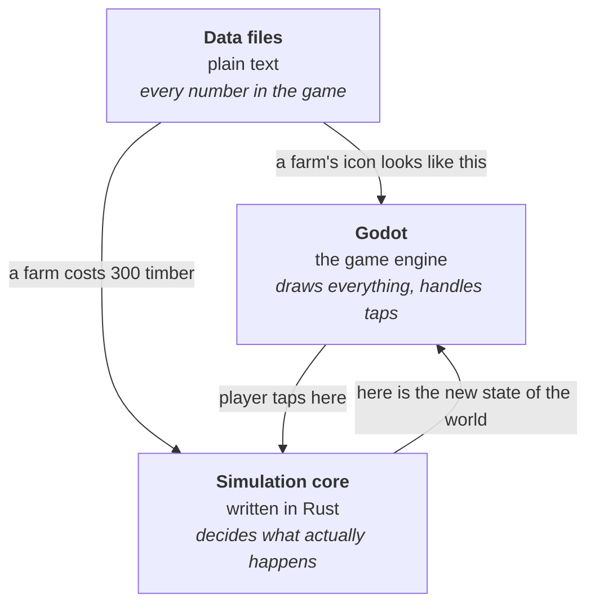

# Architecture — how Wastemarch is put together

**What this is.** This explains the major pieces of the game software and why the work is
divided the way it is. You do not need to read any code to follow it. The single most
important idea here is the *deterministic simulation*, explained below — almost every other
decision follows from it.

---

## The three pieces



### 1. Godot — the engine

An **engine** is the software that draws pictures on screen, plays sound, and notices when
you touch the screen. Wastemarch uses **Godot 4.7.1**, which is free, open source, and
exports to both iPhone and Android from one project.

Godot handles everything the player sees and hears. It does *not* decide anything about the
game's rules.

### 2. The simulation core — written in Rust

**Rust** is a programming language known for being fast and for catching mistakes before
the program ever runs. The simulation core is a self-contained piece of Rust that answers
questions like *"this archer shot at that wall — what happens?"*

It knows nothing about graphics, sound, or the passage of real time. You hand it the
current state of the world and a list of what the player did, and it hands back the new
state of the world. That is all it does.

### 3. Data files — every number in the game

How much a farm costs, how much damage a soldier does, how long an upgrade takes: all of it
lives in plain text files under `game/data/`, not buried inside the code. This means
balance changes do not require a programmer, and eventually will not require a new app
update either.

---

## The important idea: determinism

**Deterministic** means: given exactly the same starting point and exactly the same inputs,
you always get exactly the same result. Every time. On any device. Forever.

Most games are not deterministic and it does not matter. For Wastemarch it matters enormously.

### Why it matters

We want three things that all depend on it:

**Replays that cost nothing.** A battle replay is not a video. It is the starting layout,
one random number seed, and a list of "at 4.2 seconds, the player dropped an archer here."
Roughly two kilobytes. To play it back, we run the battle again and it comes out identical.
A video of the same battle would be tens of megabytes.

**Player-versus-player in version 2, without rewriting the game.** When players can raid
each other, the game has to answer: did that battle really happen the way the phone claims?
The honest answer is to re-run the exact same battle on our own server and compare. That
only works if the phone and the server agree perfectly. Because the simulation core is a
separate, self-contained piece, the server can run *the very same code* — not a
reimplementation of it, the same code.

**Confidence that a bug is reproducible.** If something goes wrong, we have the seed and
the inputs, so we can make it go wrong again on demand.

### The rule this forces: no decimal numbers in the simulation

Computers store decimal numbers (like `0.1` or `3.14159`) in a format called
**floating-point**. Floating-point arithmetic can give very slightly different answers on
different processors — an iPhone chip and a Linux server chip can disagree in the fifteenth
decimal place.

Fifteen decimal places sounds harmless. It is not. One tiny disagreement changes which
target a soldier picks, which changes the whole battle, and the two machines now completely
disagree about who won.

So the simulation uses **fixed-point** arithmetic instead: whole numbers only. Instead of
storing "1.5 metres" we store "1500 millimetres" and remember to divide by 1000 when
showing it to the player. Whole-number arithmetic is exactly identical on every processor
ever made.

**This rule is enforced automatically.** A check runs on every single change and refuses to
accept any code that uses decimal numbers inside the simulation core. It was set up in
Phase 0, before there was any code to check, precisely so it can never be quietly skipped.

---

## How the pieces connect

The simulation runs at a **fixed 20 ticks per second** — twenty times a second it takes the
world forward one step. That number never varies, on any device, regardless of how fast or
slow the phone is.

The screen, meanwhile, refreshes 60 times a second. Since 60 is three times 20, the
renderer draws two in-between frames for every simulated step, smoothly sliding things from
where they were to where they now are. This is called **interpolation** and it is purely
cosmetic — a slow phone shows fewer in-between frames but simulates exactly the same battle
as a fast one.

The arrow only goes one way. The simulation tells the graphics what to draw. **The graphics
never tell the simulation anything.** If they did, a phone that dropped frames would produce
a different battle, and determinism would be gone.

---

## The three Rust pieces

The simulation lives in a `sim/` folder split into three parts:

| Part | What it is for | Status |
|---|---|---|
| **`sim-core`** | The actual rules of the game. Depends on nothing. This is the piece that must be perfectly deterministic. | **Foundations built** — see below |
| **`sim-godot`** | A thin translation layer that lets Godot talk to `sim-core`. This is what ships on the phone. | Stub — Phase 1 |
| **`sim-server`** | The same `sim-core`, wrapped for our server to use when validating battles. | Stub — Phase 9 |

The point of the split: `sim-core` is written once, and both the phone and the server use
it unchanged. `sim-godot` and `sim-server` are just different doorways into the same room.

### What is built so far

Three foundation pieces, in the order they had to be built — each one is the ground the next
stands on, and none of them can be swapped out later without redoing everything above.

**The number type.** A whole-number type standing in for decimals, with 12 bits set aside
for the fractional part. One metre divides into 4,096 steps. Adding 4,096 of the smallest
possible steps gives *exactly* one, with no drift — the property decimal numbers cannot
offer and the reason for all of this.

Two design choices worth knowing about:

- *Multiplication and division round by the same rule.* Which rule matters far less than the
  fact that it is one rule. Mixed rounding is the kind of quiet asymmetry that produces a
  disagreement nobody can find.
- *Numbers too big to represent stop the program.* The alternative is silently wrapping
  around to a wrong-but-plausible value, which in the online version means a phone and a
  server disagreeing about a battle with nothing to investigate. A crash is a bug report.

**The random number generator.** One seeded generator, and the seed is part of the battle
record. Same seed, same sequence, on any device, forever. Nothing in the simulation may use
any other source of randomness — not the clock, not the system generator — and nothing
outside the simulation may draw from this one, because taking a number for a visual effect
would shift the battle.

**State hashing.** Squeezes an entire simulation state into one 64-bit number, so two
machines can compare results in a single comparison. Deliberately hand-written rather than
using the one built into the programming language, because that one is explicitly allowed to
give different answers on different machines — which would have worked perfectly in testing
and then failed silently in exactly the situation it was there to catch.

These three are tied together by a check that runs a fixed minute of simulated arithmetic and
compares the result against a recorded number, **on Intel Linux and Apple Silicon macOS at the
same time, on every change**. See [TESTING.md](TESTING.md#5-cross-platform-determinism).

Still to come in Phase 1: units and buildings, the grid, how troops find their way around
walls, what they choose to attack, and damage.

---

## What we have deliberately kept out

Each of these is a decision, not an oversight. Every one of them is something that is
either a legal obligation, a privacy risk, or a thing that would make the game worse.

| Not in the game | Why |
|---|---|
| Advertising, and any advertising toolkit | Ads bring in third-party tracking code we cannot audit, and they make a premium-feeling game feel cheap. |
| Loot boxes | Real regulatory exposure in the EU, UK, Belgium and the Netherlands. Not worth it. |
| Anything you can buy that makes you stronger | A design decision. Purchases are cosmetic, or they save time. Never power. |
| AI running inside the shipped game | All AI in this project is used at build time, on your Mac, to make art and audio. The game itself contains no AI and sends no player data anywhere. This keeps us clear of Apple's guideline 5.1.2(i). |
| Player chat, or any player-created content | Both require moderation systems we cannot staff. |
| Firebase | Google's analytics and backend product. Ties us to Google's data practices for no benefit we cannot get elsewhere. |

---

## Where the files live

```
Wastemarch/
├── MASTER_PLAN.md    the authority on what we are building
├── CLAUDE.md         the engineer's working rules
├── docs/             this folder — for you
├── .agent/           the engineer's working memory — technical
├── game/             the Godot project: everything the player sees
├── sim/              the Rust simulation: everything the game decides
├── tools/            scripts that make art and audio. Never shipped.
├── assets-src/       original art files, before they are prepared for the game
└── ci/               scripts that check the project is healthy
```

**`assets-src/` versus `game/assets/`.** `assets-src/` holds the originals — the full-detail
Blender files, the concept paintings. `game/assets/` holds the compressed, cut-down versions
that actually ship on the phone. Originals never ship; they are far too large.

---

## Related

- [ENVIRONMENT.md](ENVIRONMENT.md) — the exact tool versions this all runs on
- [ASSET_PIPELINE.md](ASSET_PIPELINE.md) — how art is made
- [ADR-0001](decisions/ADR-0001-stack-choices.md) — why Godot and why Rust
