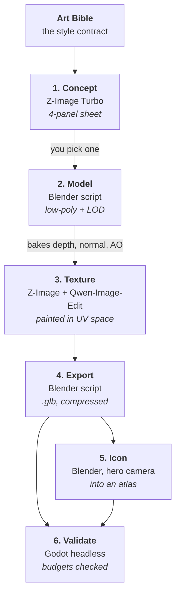

# Asset pipeline — from a sentence to a building in the game

**What this is.** This explains how a building goes from a written description to something
standing in the game world, and which tools do which part. It also records the licensing
rules, which are a legal matter and not negotiable. Nothing here is built yet — this is the
design that Phase 2 implements.

---

## The idea in one sentence

We describe a building in words, generate concept art from that description, build a 3D
model to match, generate its surface texture using the model's own geometry as a guide, and
finally photograph the finished model to produce its interface icon — so the icon and the
building can never drift apart.

---

## The stages



### Stage 1 — Concept

The image generator produces a four-panel sheet for each asset: front view, side view, a
three-quarter view *at the exact game camera angle*, and a solid black silhouette.

The prompt is assembled automatically from the [Art Bible](ART_BIBLE.md) header plus that
asset's own description file, so every generation inherits the same style rules without
anyone retyping them.

The random seed is recorded. **You pick one panel set**, and the pick is saved permanently.
This is the human approval step and it does not get automated away.

### Stage 2 — Model

A committed Blender script builds the mesh. **Not by hand, and not by an interactive AI
session** — by a script that is stored in the project and can be re-run at any time to
produce the identical result.

Where possible the script builds things *parametrically* — from parameters rather than from
a fixed shape. One script that produces a keep at five levels is enormously better than five
hand-made models: change the roof style once and all five update.

The script unwraps the texture coordinates at the locked texel density, generates the
simplified LOD copy, and **checks the triangle budget. Over budget fails the build.**

### Stage 3 — Texture

Blender first renders the bare model from several technical angles — how far each point is
from the camera (**depth**), which way each surface faces (**normals**), and which crevices
are naturally shadowed (**ambient occlusion**).

Those renders are fed to the image generator as guides, so it paints a texture that follows
the actual geometry rather than inventing its own. A window ends up where the model has a
window.

The result is packed into a single combined texture for efficiency.

### Stage 4 — Export

Blender bakes the fine surface detail down, applies the shared material, and exports a
`.glb` file — the standard interchange format for 3D models — with the LOD copy included.

It then validates: no faces with more than four sides, no stray disconnected geometry,
correct scale (1 unit = 1 metre), and origin at the centre of the footprint.

### Stage 5 — Interface icons

The *same* `.glb` is photographed by Blender from a fixed flattering angle on a transparent
background at 256 × 256, and the results are packed into an **atlas** — one large image
holding many small ones, so the game loads one file instead of hundreds.

This is where the traditional "pre-render everything to 2D" approach genuinely pays off. One
3D source of truth means the icon on a building card is always the same building that is
standing in your town. They cannot drift apart, because they are the same object.

### Stage 6 — Validate in the engine

Godot imports everything with no window open, places every asset in a test scene, takes a
screenshot, and checks the draw-call and triangle budgets from the
[Art Bible](ART_BIBLE.md#whole-scene-budgets).

```bash
$GODOT --headless --path game --script res://tools/validate_assets.gd
```

---

## What drives all of it

A single file, `tools/pipeline/manifest.yaml`, lists every asset and its target state:

```yaml
- id: town_hall
  kind: building
  levels: [1, 2, 3, 4, 5]
  footprint: [4, 4]
  concept_prompt_ref: prompts/buildings/town_hall.md
  poly_budget: 4000
  status: modelled        # concept → modelled → textured → exported → in_game
```

The orchestrator reads this, works out what is out of date, and runs only what is needed.
Each stage records a fingerprint of its inputs, so nothing is rebuilt without a reason.

```bash
python tools/pipeline/run.py --asset town_hall
```

That one command going from prompt to finished in-game building, unattended, **is the
Phase 2 completion test.**

---

## Licensing — not negotiable

Every AI model in this pipeline must be **Apache 2.0 or MIT** licensed. Both permit
commercial use without restriction.

| Purpose | Model | Licence |
|---|---|---|
| Text to image | **Z-Image Turbo** (6 billion parameters) | Apache 2.0 |
| Editing an image while keeping its structure | **Qwen-Image-Edit-2509** (20 billion) | Apache 2.0 |
| Narration and interface voice | **Kokoro** (82 million) | Apache 2.0 |
| The three named characters' voices | **Chatterbox** (350 million) | MIT |

### Banned, permanently

| Model | Why |
|---|---|
| **Flux Kontext** | Its licence permits non-commercial *use of the model*. The images it makes are yours, but running it as the asset factory for a game you intend to sell is exactly what requires a paid licence from the vendor. It would be a liability sitting at the centre of the pipeline. |
| **XTTS-v2** | Non-commercial only. The company behind it shut down in 2024, so there is no path to buying a commercial licence. It does not matter how good it sounds. |

### Two more rules

**Never clone a real person's voice.** Synthetic voices only, generated from scratch.

**Record everything.** Every generated asset stores the model name, the exact prompt, the
random seed, and a fingerprint of the workflow that made it. This is reproducibility — being
able to regenerate an asset in six months — and it is also legal provenance, being able to
demonstrate where every pixel came from.

---

## What runs on 24 GB, and what does not

Your Mac has 24 GB of memory shared between the processor and graphics. That is workable but
tight, and image generation on macOS is meaningfully slower than on a dedicated graphics
card.

| Tool | Reality on this machine |
|---|---|
| **Z-Image Turbo** | Comfortable. Seconds to about a minute per image. This is the workhorse — use it for 90% of everything. |
| **Qwen-Image-Edit-2509** | Must use the heavily compressed version. Expect several minutes per image and close other applications first. Use it surgically, never in bulk. |
| **Blender** | Fine. Either renderer works well. |

**The rule that keeps things from falling over: never run image generation and a Blender
render at the same time.** The orchestrator runs graphics-heavy stages strictly one after
another. Two at once on 24 GB will start swapping to disk and take ten times as long, or
simply fail.

**Working rhythm:** batches are queued during the day and run overnight. The batch runner
**must be resumable** and write each result as it finishes — a crash at item 40 must not
cost items 1 through 39.

**Escape hatch:** if a texture pass would take more than one night, rent a cloud graphics
machine for a few hours at roughly $2/hour. The pipeline is built so the ComfyUI address is
a setting, not a code change — so this is a configuration switch, not a rewrite.

---

## One tool that is deliberately restricted

**Blender MCP** lets an AI drive Blender interactively — "make me a building facade with
eight floors." It is genuinely good at *exploring* an idea.

It is the wrong tool for producing things that ship, because:

- It is a live interactive session. Anything we ship must be rebuildable from a clean copy
  of the project.
- Its output is not versioned. If the model behaves slightly differently next month, the art
  drifts and there is no way to see what changed.
- It cannot run unattended overnight, or on a fresh machine.

**The rule:** Blender MCP may be used only inside `tools/blender/scratch/`, for working out
*how* to do something. The answer is then written into a committed script, and only the
script's output ships. That folder is excluded from version control entirely.

---

## Related

- [ART_BIBLE.md](ART_BIBLE.md) — the rules this pipeline enforces
- [ENVIRONMENT.md](ENVIRONMENT.md) — tool versions and exact commands
- [ROADMAP.md](ROADMAP.md) — Phase 2 is where this gets built
