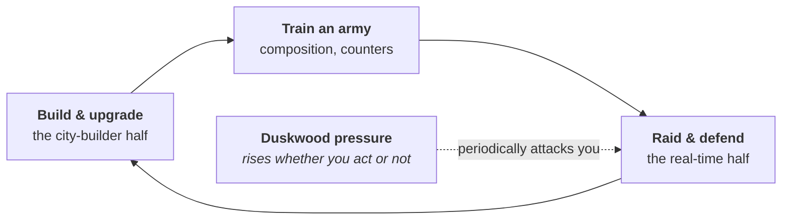

# Game design — what the player actually does

**What this is.** This describes Wastemarch as a game: the loop the player repeats, the
resources they gather, how building works, and how battles work. It is the *rules*
companion to [STORY.md](STORY.md), which covers the world and characters. Where this
document and the master plan disagree, the master plan wins until a decision record says
otherwise.

---

## The one-line version

You inherit a dead borderland with two servants nobody wanted, and you rebuild it into
something the kingdom that discarded you will one day have to negotiate with.

The feeling we are aiming for is **not** "I am powerful." It is **"I am the only person here
who can see what this place could be."** Every design decision below should be checked
against that sentence.

---

## The core loop

Building produces resources and unlocks. Resources pay for an army. The army wins raids.
Raids yield loot and story progress, which fund bigger building. Around it all, the
**Duskwood pressure** rises on its own and periodically sends something at your base.

That pressure system is doing important work. In games like *Clash of Clans*, the tension
comes from other players raiding you. Wastemarch version 1 has no other players, so the
forest provides it instead. It is a *system* rather than *content*, which means it scales
without us hand-authoring hundreds of attacks.

**And it is tied to the story.** Every improvement you make to the land brings the thing
beyond the trees closer. Getting better at the game increases the pressure on you. That is
the engine of Season 2.

---

## Resources

| Resource | Where it comes from | What it buys |
|---|---|---|
| **Grain** | Farms, fisheries | Training troops, feeding your population |
| **Timber** | Logging camps at the Duskwood's edge — *which raises pressure* | Construction |
| **Stone** | Quarries | Walls and defensive buildings |
| **Iron** | Deep mines | Advanced troops, better weapons |
| **Duskglass** | Duskwood raids only | The premium upgrade material |
| **Crowns** | Trade, taxes, coastal salvage | Finishing things instantly, Ostmere politics |

Timber is the interesting one. The only good wood is at the edge of the dark forest, and
cutting it makes the forest angrier. The player is repeatedly choosing between growth and
safety, which is a better decision than "click the tree."

**Duskglass is earnable and is never the paywall.** In this genre the premium material is
usually sold for real money and gates progress. Ours is won by playing well. See
monetisation below.

---

## Base building

- **Grid:** 44 × 44 tiles, expandable in wedges toward each of the four borders.
- **Two builders to start** — you and Durn. A third is earned through the story. A fourth
  may eventually be purchasable.
- **Redesigning your base is free.** Rearranging costs nothing and takes no time.

That last one is a deliberate break from the genre. Competitors charge you or make you wait
to move a building, purely to sell convenience. Players hate it. We are not doing it.

### What exists today

Six buildings are built, textured and placeable, which is what Phase 3 asks for. Every one
pays for another, so the loop closes:

| Building | Tiles | Costs | Produces |
|---|---|---|---|
| Keep | 4×4 | 60 stone | 2 timber / 6 s |
| Granary | 2×2 | 30 timber | 3 grain / 5 s |
| Watchtower | 3×3 | 40 grain, 20 timber | 2 stone / 8 s |
| Croft | 3×3 | 25 timber | 4 grain / 6 s |
| Logging Camp | 3×3 | 35 grain, 15 stone | 3 timber / 6 s |
| Deep Mine | 2×2 | 40 stone, 40 timber | 1 iron / 10 s |

**Every number there is a placeholder.** They live in `game/data/buildings.json`, not in code,
and Phase 5 sets the real curve against a spreadsheet. What matters now is only that there is
always a reason to place something.

**Every building upgrades to level 5.** Tap a finished building and a short row appears
*underneath it* — its name, its level, and one button with the next level's price on it. Each
level costs more, takes longer, and yields more; the multipliers are in the same data file, and
Phase 5 replaces them with an explicit per-level table.

**The art does not have to keep up with the levels.** A building uses the best model it has at
or below its level. The keep has models for levels 1, 3 and 5; the other five have one each.

**But an upgrade still has to be visible, and at first it was not.** Five of the six buildings
looked identical at every level and nothing on screen said otherwise, which reads as a bug
whether or not it is one. Two things fix it without an asset:

- **The building gets a little bigger and its colour moves** at each level — up to 12% larger
  and a step towards Ostmere gold by level 5. This is what Clash of Clans does for most of its
  own level-ups. The values are in `buildings.json` under `level_look`.
- **The panel says what the upgrade buys**, as before and after: *"Timber 2 → 3 every 6s"*.
  Their upgrade dialog shows "400 + 400" rather than "800", and that is most of why an upgrade
  feels like something happened. A level number on its own does not.

Distinct art for every level is thirty models and a few hundred megabytes of baked texture for
buildings that are still placeholder. That is in [BACKLOG.md](BACKLOG.md), not done now.

### Adjacency bonuses — the part that makes layout interesting

Buildings care about their neighbours:

- A granary next to farms increases their yield.
- Barracks next to a drill yard train troops faster.
- Housing next to the Duskwood-facing wall generates **unrest** — people do not like
  sleeping next to that.

Without this, base layout is just a packing puzzle. With it, layout is a genuine strategic
decision with trade-offs, and it is the mechanical expression of Aldric's whole character:
he is the only one who thinks about where things go.

---

## Combat

Battles are real-time. You pick a spot on the edge of the enemy base, drop your troops, and
they advance and pick their own targets. You have limited but real influence once it starts.

### Three things that make it ours, not a clone

**1. Terrain matters.** The ground has mud, rock, and treeline tiles that change movement
speed and what units can see. *Where* you deploy is a real decision, not just which side.

**2. Seraphine's Orders.** Three command cards per battle — **Rally**, **Hold**, **Feint** —
each on a cooldown. A thin layer of live skill on top of a system that is otherwise
fire-and-forget. This is what Seraphine teaches you, and it is why she is in the game
mechanically and not just narratively.

**3. No spells.** The genre standard is a second resource you throw at problems. Orders
replace it: cleaner, easier to read at a glance, and a smaller game to build.

### Every battle is recorded

A battle produces a small record — the starting layout, the random seed, and the list of
what you did and when. Roughly two kilobytes. Replaying it re-runs the battle rather than
playing a video, and it comes out identical every time. See
[ARCHITECTURE.md](ARCHITECTURE.md#the-important-idea-determinism).

---

## Story and progression are the same curve

Six chapters, roughly twelve hours to the endgame. **Each chapter unlocks from a base
milestone, not from a chapter counter.** Story pacing and progression pacing are therefore
the same line, and the player never sits at a story wall with nothing to build, or builds
past the story into silence.

| # | Chapter | Unlocked by | What it feels like |
|---|---|---|---|
| 1 | Arrival | Keep repaired | *Can we even survive here?* |
| 2 | Foothold | First wall and first harvest | *We might actually live.* |
| 3 | Recognition | 200 population | *They noticed.* |
| 4 | Pressure | Surviving a defended siege | *The forest is getting organised.* |
| 5 | The Old Compact | Reaching the north-east ruin | *The land was killed on purpose.* |
| 6 | Leverage | Kingdom-tier holding | *The King who threw you away needs something.* |

Full detail in [STORY.md](STORY.md).

---

## Monetisation

**Version 1 ships free with the store switched off.** The plumbing for purchases is built in
from the start so that turning it on later is a settings change rather than a re-architecture
— but nothing is for sale at launch.

When it is switched on:

| Will sell | Will never sell |
|---|---|
| Cosmetic skins | Anything that makes you stronger |
| An extra builder | Loot boxes or any randomised purchase |
| Time-skip bundles | Advertising, of any kind |
| A battle pass | |

**No loot boxes** is a legal position as much as an ethical one. Belgium and the Netherlands
have banned them outright; the EU and UK regulate them. The revenue is not worth the
exposure.

**No pay-to-win** is a design position. The whole premise is a man with no advantages who
wins by thinking better. Selling advantages would contradict the game's own argument.

---

## Related

- [STORY.md](STORY.md) — the world, characters, and opening script
- [ROADMAP.md](ROADMAP.md) — when each of these systems gets built
- [ART_BIBLE.md](ART_BIBLE.md) — how it all looks
