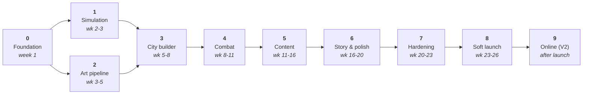

# Roadmap — the nine phases

**What this is.** This is the whole project broken into nine phases, with a concrete test at
the end of each one that decides whether it is finished. The tests are deliberately blunt
and objective, because "it feels mostly done" is how solo projects die. Realistic total to a
global launch is **six to seven months** of consistent work.

---

## The rule that makes this work

**A phase is not finished until its test passes, and the next phase does not start until
then.** No exceptions, no "I'll come back to it."

Every good idea that arrives mid-phase goes into [BACKLOG.md](BACKLOG.md). It does not get
quietly added to the current phase. Scope creep is the single most common reason projects
like this never ship.

---

Phases 1 and 2 run at the same time. Everything else is in order.

---

## Phase 0 — Foundation · week 1 · **in progress**

Set up the project so that everything after it is easy. The repository, large-file storage,
all the documentation you are reading, the working-memory files the engineer uses to survive
between sessions, an empty Godot project configured correctly for phones, the empty
simulation crates, and automatic checks running on every change.

**Finished when:** a plain grey cube renders on a real iPhone *and* a real Android phone,
from a build produced automatically rather than by hand.

Why a grey cube? Because it proves the entire chain works end to end — project settings,
engine, build system, signing, installing on a device — while containing nothing that could
itself be broken. If the cube appears, everything underneath it is sound.

**Still outstanding:** iOS signing certificates and an automated build; the Android toolchain
is not installed yet.

## Phase 1 — The simulation core · weeks 2–3

Build the rules engine in Rust: whole-number arithmetic, seeded randomness, units, the grid,
pathfinding, target selection, damage. Wire it into Godot. Add a check that runs the same
battle on a Mac, on a Linux machine, and on a phone chip, and compares the results.

**Finished when:** the same battle produces a byte-for-byte identical result on macOS, on
Linux, and on an ARM device.

**Seeded randomness** means the random numbers come from a starting value we choose, so the
same starting value always produces the same sequence. It is randomness you can replay.

## Phase 2 — Art bible and asset pipeline · weeks 3–5, alongside Phase 1

Install the image-generation tools cleanly. Write [ART_BIBLE.md](ART_BIBLE.md) — the rules
every asset obeys — and prove it works by taking **three** buildings all the way from a text
prompt to something standing in the game. Build the machinery that runs this unattended
overnight.

**Finished when:** one command turns a prompt into a finished 3D building plus its interface
icon, with nobody watching.

This phase is where the "premium look" is won. See the risk table at the bottom of this file.

## Phase 3 — City builder · weeks 5–8

The world in 3D, a camera you can pan and pinch-zoom, placing buildings on the grid with
snapping, build and upgrade timers, four resources, six buildings, saving and loading, and
Durn teaching you to build.

**Finished when:** you can play for twenty minutes on your own phone and want to keep going.

That test is deliberately about *feeling*, and it is deliberately this early. If the core
loop is not fun at week 8, no amount of content in months 3–6 will rescue it.

## Phase 4 — Combat · weeks 8–11

The battle screen running on the Phase 1 simulation, the deployment interface, four troop
types that counter each other, defensive buildings, Seraphine's Orders, destruction effects,
results, and replay playback.

**Finished when:** a battle replays frame-for-frame identically from its record, twice in a
row.

## Phase 5 — Content and economy · weeks 11–16

The full building set — around 24 buildings across 5 levels each — eight troop types, the
Duskwood pressure system, adjacency bonuses, and the progression curve tuned against a
spreadsheet before it is tuned in the game.

**Finished when:** the balance model shows a clean twelve-hour progression with no
stretches where the player has nothing to do but wait.

## Phase 6 — Story and polish · weeks 16–20

The prologue, six story chapters, character portraits, voice for the opening and the three
companions, music, the full interface theme, and *juice* — camera shake, particles, a
satisfying thump when a building completes.

**Finished when:** a stranger playing it says it looks like a real game.

**Do not compress this phase.** This is where "premium" is won or lost. A mechanically
identical game with and without this phase are two different products commercially.

## Phase 7 — Hardening · weeks 20–23

Translation scaffolding (English plus four languages), accessibility (larger text,
colourblind-safe colours, reduced motion), testing across a range of devices including a
cheap Android phone, memory and battery profiling, recovery from corrupted saves, crash
reporting, analytics, the AI-content disclosure screen Google Play requires, privacy policy,
and store listings.

**Finished when:** every item on the release checklist is green.

## Phase 8 — Soft launch · weeks 23–26

Release to TestFlight and Google Play internal testing, then a closed beta in two small
markets. Measure how many players return the next day and the next week, and where they stop
playing. Fix the top five drop-off points. Then launch globally.

## Phase 9 — Online · after launch

Accounts, base snapshots, matchmaking, server-side battle validation, clans, leaderboards,
seasons. In-app purchases switched on.

Because the simulation was built deterministic from Phase 1, this is **added on top**, not
surgery. That is the entire reason for the architecture in
[ARCHITECTURE.md](ARCHITECTURE.md).

---

## The risks worth actually worrying about

| Risk | How bad | What we do about it |
|---|---|---|
| **The art looks AI-generated and inconsistent** | Fatal to the goal | The Art Bible is written before any asset. Three reference buildings get your personal approval before anything is made in bulk. Every later asset is compared against them. |
| **Trademark trouble over the name** | App pulled without warning | "Wastemarch" is a working title. Run a trademark search before any public listing. Register early. |
| **Decimal numbers creep into the simulation** | Breaks online play permanently | An automatic check refuses them. Set up in Phase 0, before any code existed. |
| **Scope creep** | The usual killer | Phase gates with blunt tests. New ideas go to the backlog, never into the current phase. |
| **24 GB of memory is not enough for texture generation** | Slow, not fatal | Use the smaller compressed models, run one job at a time, make batches resumable, rent a cloud machine for a few hours if a batch would take more than one night. |
| **Poor performance on cheap Android phones** | Bad reviews | The Mobile renderer, strict draw-call and triangle budgets enforced automatically, and testing on a real cheap phone every phase. |
| **Losing the thread between sessions** | Slow bleed | The `.agent/` working-memory protocol, followed without exception. |
| **Burnout** | High, and underrated | Something playable at the end of every phase. Phase 3's test is literally "you want to keep playing" — that is the fuel for the remaining five months. |
