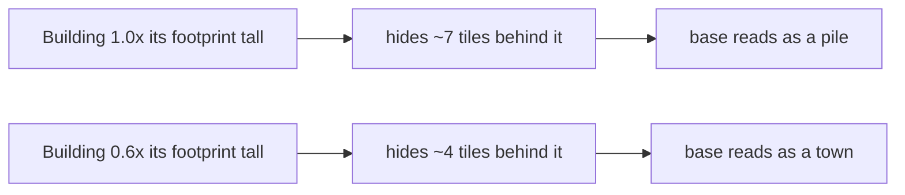
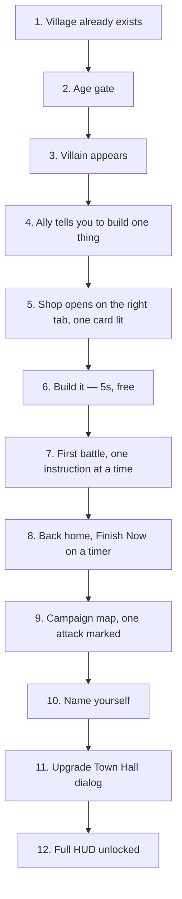

# Clash of Clans — a measured teardown of the first ten minutes

**What this is.** Sixteen screenshots of Clash of Clans' opening, taken on a phone, pulled
apart into numbers we can build against. Everything below that is stated as a number was
*measured off the pixels*, not remembered or guessed, and the method for each measurement is
written down so you can disbelieve it and check. It exists because you asked why a game made
fourteen years ago looks better than ours, and the honest answer turned out to be three
specific numbers rather than a mystery.

---

## The short version

Three things separate their screen from ours. None of them is talent, budget, or the year.

1. **Their buildings are half as tall as ours, relative to the ground they stand on.**
   Their Town Hall is 0.55 as tall as its footprint is wide. Ours were allowed up to 1.6, and
   the keep actually stood at 0.98. This one number is most of the difference. A tall
   building at this camera angle hides the ground behind it, so a base of tall buildings
   looks like a pile, and a base of squat ones looks like a town.
2. **Every building is a bit smaller than the ground it owns.** Their Town Hall art covers
   about 69% of its 4×4 tiles, so a ring of grass runs round it. That ring is what stops two
   neighbours merging into one blob when the phone is at arm's length. Our rule went the
   other way — it *allowed* buildings to overhang their tiles by 35 cm.
3. **Nothing casts a shadow onto the ground.** Not buildings, not trees, not troops. The
   depth comes from painted shading inside each object, not from the engine throwing
   shadows around. Shadows are the fastest way to make an isometric base look muddy, and
   they simply do not use them.

Our camera, it turns out, is already exactly right. See "The camera" below — we specified
30° and 45° in the Art Bible a week ago and that is, to the degree, what they use.

---

## How anything here was measured

Two techniques, both in `tools/` nowhere — they were one-off scripts, and the numbers are
what survive. If you want to re-derive them, the method is:

**Angles and tile sizes.** A grid of squares seen from above at an angle turns into a grid of
diamonds. Measure the slope of a diamond's edge on screen and you have the camera angle,
because the slope *is* the projection. Their footprint diamonds have a slope of 0.507 — for
every 100 pixels across, 50 pixels down. That is 1:2 to within measurement error.

**Zoom.** Take a picture of the same building at their most zoomed-out and their most
zoomed-in. Shrink the zoomed-in one by 12%, 13%, 14% … and at each size ask a computer how
well it matches the zoomed-out one. The size that matches best is the zoom ratio. The answer
was 25%, matching at 0.89 out of a possible 1.0, which is an unusually clean result — so the
zoom range is exactly 4×.

Everything else — proportions, colour, layout — is measured off crops with a pixel ruler
drawn on top.

---

## The camera — we already had this right

| | Clash of Clans (measured) | Wastemarch (`ART_BIBLE.md`) |
|---|---|---|
| Projection | Orthographic — no perspective | Orthographic |
| Elevation | **30° above the horizon** | 30° |
| Rotation | **45°**, and it never changes | 45°, no rotation |
| Tile shape on screen | **2 wide : 1 tall** | 2:1 (follows from 30°) |

*Orthographic* means distant things are drawn the same size as near things — it is what makes
these games read like a diagram. *Elevation* is how far above the ground the camera sits; 30°
is low enough that you see the *fronts* of buildings, not just their roofs. The relationship
is exact and worth knowing: a tile looks twice as wide as it is tall **because** the sine of
30° is one half. If somebody ever asks to raise the camera to 35°, they are asking to change
the tile shape.

**Nothing about our camera needs to change.** That was the surprise of this exercise.

---

## The zoom — measured, and now ours

| | Measured | What we set |
|---|---|---|
| Range from fully out to fully in | **4.00×** | 4.00× |
| Fully out shows | the whole 44×44 village, ~6% margin | same, computed from the grid |
| Fully in shows | about 13 tiles across the screen | same |
| Tile size, fully out | ≈ 53 × 27 screen pixels | — |
| Tile size, fully in | ≈ 213 × 107 screen pixels | — |
| Opening view | fully zoomed out | fully zoomed out |

We previously allowed a 10× range: out until the city was a smudge, in until one building
filled the screen like furniture. Neither extreme is a view anybody plays from, and both make
the art look bad — far out kills the silhouettes, far in shows every simplification.

The limit is now worked out at runtime from the grid size and the shape of the screen, in
`game/city/city.gd`, because a phone is roughly 2.17:1 and a tablet is 1.33:1 and a single
typed-in number would be wrong on one of them. On a phone it lands on 32; on a 16:9 screen,
37.

---

## The proportions — the finding that matters

This is the section to read if you read one.

Measured from the maximum-zoom screenshot, where a pixel is worth about 5 mm of village:

| Building | Footprint | Art width vs footprint | Height vs its own base | Height vs footprint |
|---|---|---|---|---|
| Town Hall 1 | 4×4 | 0.69 | 0.80 | **0.55** |
| Barracks | 3×3 | ~0.7 | ~0.63 | **0.44** |
| Gold Storage | 3×3 | ~0.7 | ~0.4 | **~0.3** |

And ours, before today:

| Building | Footprint | Height vs footprint |
|---|---|---|
| Granary | 2×2 | 1.26 |
| Watchtower | 3×3 | 1.23 |
| Keep | 4×4 | 0.98 |

Ours were between two and four times too tall for their ground. Everything you disliked about
the look follows from that: buildings hide each other, the base reads as a stack rather than a
settlement, and every silhouette is a tower.

### Why height is so expensive at this camera

At 30° elevation, a building of height *h* covers roughly **1.7 × h** tiles of ground behind
it. A 4 m keep on a 4×4 plot therefore blots out nearly seven tiles of whatever is behind it.
A 2.4 m one blots out four. Since the ground behind is where the *next* building goes, height
is the single most expensive property a building can have.

### What we changed

`tools/blender/build_asset.py`:

- `HEIGHT_TO_FOOTPRINT_LIMIT` — **1.6 → 0.6.** Measured, not chosen.
- New `FOOTPRINT_FILL = 0.8` — a building's geometry may fill at most 80% of the tiles it
  occupies, so the ring of grass exists by rule. This *replaces* the old overhang allowance,
  which permitted the opposite.
- New `reproportion()` — squashes a finished model down into those limits automatically, and
  both the model path and the texture-baking path now go through one `build()` function so
  the two cannot disagree. (They did disagree, once, for about ten minutes.)

Result, rebuilt and passing:

| | before | after | squashed by |
|---|---|---|---|
| Granary | 2.62 m on 2×2 | 1.20 m | ×0.46 tall, ×0.65 wide |
| Watchtower | 4.25 m on 3×3 | 1.80 m | ×0.42 tall, ×0.82 wide |
| Keep | 3.90 m on 4×4 | 2.40 m | ×0.62 tall, ×0.73 wide |

The silhouette test still passes — the closest pair is now watchtower vs keep at 0.52, well
inside the 0.80 limit.

**The honest caveat.** Squashing a model that was hand-tuned at the old proportions is not the
same as designing it at the new ones: roof pitches flatten a little and small details lose
some of their shape. It is the cheap way to *see* the change today. Once you approve the
proportions, each builder's own numbers get re-tuned and the squash becomes a no-op. There is
a `ponytail:` note in the code saying exactly that.

---

## The ground

- **One tile = one checker square.** The grass alternates light and dark per tile, at very
  low contrast — perhaps 5%. You cannot consciously see the grid, but you can always tell
  where a building will land. This is the cheapest legibility trick in the game.
- **Large-scale mottling on top**, unrelated to the grid, so the field does not look like
  graph paper.
- **Every prop sits on its own patch.** Trees, rocks, stumps and flowers each have a small
  richer-green diamond under them. That patch is what makes the prop feel planted rather
  than pasted. Ours have nothing of the kind.
- **Occupied tiles are very slightly lighter** than free grass, which outlines each
  building's plot without drawing a line.
- The playable field is a diamond ringed by dark forest, cliffs and water — a hard frame that
  tells you the world ends there, with the north edge always in shadow.

---

## Light and shadow

- **A single warm key light from the upper left.** Left-facing roof slopes are bright, right-
  facing ones are a step darker, front walls are in soft shade.
- **No cast shadows on the ground. None.** Not from buildings, trees, or troops. The dark
  under a building is painted into the building, not thrown by a light.
- Two or three flat tones per surface. No specular highlights, no visible reflections.
- The only genuinely bright things are the resource icons, fires, and the gold pile — light is
  used as a pointer, not as realism.

**What we changed:** `Sun` in `game/city/City.tscn` no longer casts shadows. Its direction was
already upper-left and stays. Our ambient-occlusion bake already puts the soft dark contact
under each building, which is the same trick they use. This is also free performance — a
shadow pass is one of the more expensive things a phone does.

---

## Colour and readability

- **Roof colour is the building's name.** Town Hall orange, Barracks red, Elixir purple, Gold
  yellow, Army Camp gold-and-orange. You identify a building by its roof colour before you
  can make out its shape.
- **Bases are neutral** — grey stone, brown timber — so the roof does the identifying.
- The ground is a single mid-green across the whole map, which is what lets every saturated
  roof read against it. There is no competing colour anywhere on the field.

Our palette is deliberately muted (ADR-0004, and the wasteland setting demands it), so we
cannot copy their saturation. What we *can* copy is the structure: one identifying colour per
building, on the roof, against a neutral ground. That is a note now in the Art Bible.

---

## The opening flow, screen by screen

**1 — Welcome.** The village is *already built* when you arrive: Town Hall, a builder's hut, a
gold mine with a full coin bubble, a lit campfire, a ruined building. Nothing is empty. An
ally — a red-haired woman, drawn as a half-figure in the bottom-left corner with a speech
bubble to her right — says "Welcome Chief! Let's get started." Everything except her and the
village is dimmed by a heavy vignette.

**2 — Age gate.** A centred grey panel with a chunky number pad, a red ✗ and a grey ✓, and a
small "Why am I seeing this?" strip beneath. Legally required, done in twelve seconds, in the
game's own art. The village stays visible behind it.

**3 — The villain.** A goblin appears in the **bottom-right** corner — mirror image of the
ally's position — with the bubble on his left. Friendly characters live on the left, hostile
ones on the right, for the whole game. He gets one line: "Gwahaah, what is this? Another puny
human!"

**4 — The order.** The ally returns, panicked, with a specific instruction: "Oh no, GOBLINS!
Quickly, set up a Cannon to defend the Village!" The Shop button appears bottom-right with a
big animated arrow on it. One instruction, one button, everything else dimmed.

**5 — The shop.** A full-screen sheet: tab row (Army / Resources / Defenses / Traps) with the
right tab pre-selected, then a horizontal row of cards. **The Cannon card is in full colour
with a yellow arrow; every other card is greyed out and stamped "Level 2 Town Hall
Required".** That greying is doing two jobs — it removes every wrong choice, and it shows you
the whole future of the game in one screen. A resource bar runs along the bottom.

**6 — Build it.** The Cannon costs 250 gold, which you were given, and takes **5 seconds**.
The goblin returns: "Gwar! Goblins ATTAAACK!!" with a green **Bring it on!** button *inside*
his speech bubble — the bubble is the interface.

**7 — First battle.** Same camera, different map. One instruction at a time in large white
text on the field: "Tap multiple times in an empty area to deploy your troops", with a huge
orange finger pointing where. The enemy's two buildings are outlined in red. Your troop card
sits bottom-left showing ×3; "Overall Damage 0%" sits top-right. The deploy zone is a dashed
strip round the edge.

**8 — Back home, and the first timer.** More buildings now exist. A Gold Storage is under
construction with a 6-second bar over it and a green **Finish Now** button below, marked
"1 gem", with an arrow pointing at it. This is the first time you are shown what gems are
for, and it costs one — the cheapest possible purchase, given away.

**9 — The campaign map.** A parchment sheet slides in from the left, covering about half the
screen, village still visible on the right. Goblin Forest is marked "Attack" with an arrow;
later levels are padlocked. A star counter reads 3/270 — the whole game's length shown on
day one.

**10 — Name yourself.** Only *now*, after you have built, fought, and won something. A small
dialog, one field, one green Done button, the system keyboard. Asking for a name up front
would have been asking for commitment before giving anything.

**11 — Upgrade the Town Hall.** A wide dialog: a big render of the building on the left, its
improvements on the right as green bars showing **400 → 400** and **1 000 → 1 500** — the
current value and the gain, not just the new number. Underneath, an "Unlocks Buildings" strip
of five icons, two marked NEW. Bottom right: Confirm with the price, and the upgrade time
(10s) beside it.

**12 to 16 — the HUD arrives.** The full interface only appears once the tutorial ends: player
level and name top-left, builder count and shield timer top-centre, resources top-right,
Attack!/shield/news bottom-left, Shop and settings bottom-right. Selecting a building pops a
small row of buttons **underneath it** (Info / Upgrade More / Upgrade with its cost) rather
than a panel somewhere else. Placing walls shows white ghost walls with green arrows. The
Army screen is a brown panel listing what you have, with locked sections labelled
"Spells unlock at Town Hall level 5" — again, showing the future rather than hiding it.

### The five rules underneath that flow

1. **Never an empty screen.** The village exists before you do.
2. **One action available at a time.** Everything else is dimmed, greyed, or absent.
3. **A named enemy within thirty seconds**, and a reason to build the thing you are told to build.
4. **Show the locks.** Greyed-out cards and "unlocks at level 5" labels are advertising, not friction.
5. **Ask for nothing until you have given something.** The name prompt comes after the first victory.

---

## Interface vocabulary

Worth copying wholesale, because it is all cheap:

- **Resource bars, top right, stacked.** Rounded capsule, pale fill showing how full the
  storage is, the number right-aligned, and a large icon overlapping the right-hand end and
  breaking out of the bar. Thick dark outline round everything.
- **The gem bar has a green `+` on its left** — the only sales pressure on the whole screen.
- **Every panel is a light grey sheet** with a title in white outlined letters and a red ✗ in
  the top-right corner.
- **Buttons are green for yes, red for no, grey for neutral**, always with a highlight along
  the top edge, always with a shadow. Big — a thumb is 12 mm.
- **The tutorial arrow is enormous**, orange, and animated, and points at exactly one thing.
- **Text on the world is white with a heavy dark outline**, never a box.
- **The dimming vignette** during the tutorial is heavy — perhaps 40% — and is what makes a
  bright interface readable on a bright field.

---

## Should we switch to 2D sprites?

You asked, and the answer is **no, and it would not have got you what you wanted.**

Their buildings are pre-rendered 2D images. But the look you are pointing at does not come
from being 2D. It comes from: the proportions in the table above, one identifying colour per
building, painted shading rather than engine shadows, and a fixed camera. Every one of those
is available to us in 3D, and we have applied three of them today.

What being 2D *costs* is already written down in `MASTER_PLAN.md` §1.3 — no day/night, no free
zoom, no troops correctly hidden behind buildings, and every upgrade level of every building
becoming an app-store update. Those are real costs and we would be paying them for a look we
can get anyway.

The safety net is that this is not a one-way door. Our buildings are built by script from
Blender, so the same models can be rendered to sprites at the locked camera at any point,
without re-modelling anything. If, after you see the reproportioned buildings in the city, you
still prefer the sprite look, the path is open and cheap. That is a much better position than
choosing now.

---

## What is still not matched

Being honest about the gap that remains after today:

- **Painted texture.** Theirs is hand-painted with deliberate two-tone shading. Ours is a
  tiled material with baked ambient occlusion. This is the next largest difference after
  proportion, and it is a real piece of work.
- **Ground props.** They have trees, rocks, stumps and flowers, each on its own grass patch,
  scattered over the whole field. We have bare ground. This is cheap and high-impact and
  belongs in Phase 3.
- **Colour identity per building.** Our palette gives every building the same five muted
  colours by rule, so nothing is identifiable by colour. The Art Bible now asks for one
  identifying hue per building; the palette needs a pass to supply them.
- **Characters.** Their ally and villain do an enormous amount of work for very little screen
  space. `docs/STORY.md` has Durn; he needs a portrait.
- **Squash vs design.** As noted above, today's buildings are squashed rather than designed at
  the new proportions.

---

*Sources: sixteen screenshots supplied 8 August 2026, iPhone, 2796 × 1290 landscape. Measured
9 August 2026.*
